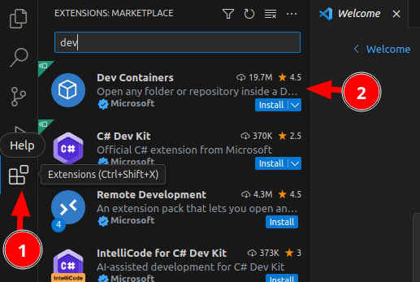

## VSCode Launch Script

When you use the ``./vscode.sh`` launch script, it will help you install all of necessary VSCode extensions, as well as open the project in VSCode.

If the code CLI is already installed, you can run

```bash
./vscode.sh
```

This will install any needed extensions and launch vscode. Wait until the process is done...

> ⭐️ **Note:** The first time you run the script, you will need to close the VSCode window that opens, and then run the script again. This is because the script will install the necessary extensions, and then you need to reopen VSCode to apply them.

## Building the dev environment

When you open VSCode the second time, a pop up (see below) will appear asking you if you want to re-open the project in a dev container. Simply click on this option, and it will automatically build the development containers for you.


> 🚧 If no "Reopen in container" popup appears automatically, you can initiate the process manually by checking [No Reopen in container shows](#no-reopen-in-container-shows) guide.

So what happens when you run the project in a dev container? The script will do the following:

1. Rebuild the dev container and mount your code tree inside the (docker) container.
2. Install all the necessary Python dependencies inside the container.
3. Set up port forwarding so that you can access the application running inside the container from your host machine.
4. Start the Django development server inside the container.

Once you click on the "Reopen in container" option, VSCode will start building the dev container. You can see the progress in the terminal window that opens up.

Once the task is running, a notification 1️⃣ will be shown in the bottom right of the VSCode window. Clicking in the notification will show you the setup progress 2️⃣. Note that this make take quite a while depending on the internet bandwidth you have and the CPU power of your machine.


At the end of this process, you will see a message like this:

```
[229365 ms] Port forwarding 53251 > 46727 > 46727 terminated with code 0 and signal null.
```

Once you see that, you can continue the next step below.

> 🚩 **Note:** The Port forwarding can change everytime you deploy. As long as it says `terminated with code 0 and signal null`, you are done and can continue to next step.

## Run application

After completing the steps above, You need to run the app.

Click the `Run and Debug` button 1️⃣ and then select `Django: Run server` 2️⃣. After it is selected, click `Start Debugging` 3️⃣.


After running, it will a new tab in the bottom right of the VSCode window.
You need to wait for the Python debug to finish starting by saying `Quit the server with CONTROL-C.`3️⃣,


## Viewing your test instance

After completing the steps above, you should have the development server available.

Just ctrl + click the url link `0.0.0.0:8080` and click `Open`


> ⭐️ **Note**: On macOS, this will show a blank page because VSCode copies using 0.0.0.0:2000, which does not work on macOS.
You can manually access it at http://localhost:2000.


Or you can access your server directly on port 2000 of your local host:

```bash
http://localhost:8000
```


The site will be rather bare bones since it will need to be configured in the admin area to set up the theme etc.

By Default, we can use the admin credential:

```bash
username : admin
password : admin
```

> 🪧 Now that the application is set up, you may begin making updates or choose to work with the provided demo data. For instructions, please refer to the [Demo Data Guide](../demo-data.md).

## Troubleshooting

### No code CLI found

If the VSCode cli check fails, you can try to install VSCode manually.

#### Linux

Try following the installation instructions for your distribution on the VSCode [download page](https://code.visualstudio.com/docs/setup/linux).

#### Windows

1. Open Windows VS Code
2. Install the "Remote - WSL" extension
3. Open a WSL terminal and try check again

#### MacOS

1. Open VS Code
2. Press Cmd+Shift+P
3. Type: Shell Command: Install 'code' command in PATH
4. Press Enter
5. This will create a symlink:

```
/usr/local/bin/code -> /Applications/Visual\ Studio\ Code.app/Contents/Resources/app/bin/code
```

And try to check it again via

```bash
code --version
```

If you succeed with setup code cli, you can move to [configuration](../configuration.md).

If you are still having trouble you can try to set up things manually.

### Installing devcontainers extension

You can install [Dev Containers](https://marketplace.visualstudio.com/items?itemName=ms-vscode-remote.remote-containers) extension manually (minimum version 0.304.0).

  


### Open project

Open the project in VSCode (1️⃣, 2️⃣) by navigating the place on your file system where you checked out the code in the pre-requisites step above (3️⃣).


Accept the 'trust authors' prompt


After that everything above is done, you can move on to [Building the dev environment](#building-the-dev-environment).

### No reopen in container shows

Press `Ctrl -> P` 1️⃣ and then `>`and search for `Rebuild`. Select `Dev Containers: Rebuild and Reopen in Container`2️⃣. This will essentially mount your code tree inside a docker container and switch the development context of VSCode to be inside the container where all of the python etc. dependencies will be installed.


> 🪧 Now that the application is set up, you may begin making updates or choose to work with the provided demo data. For instructions, please refer to the [Demo Data Guide](../demo-data.md).
