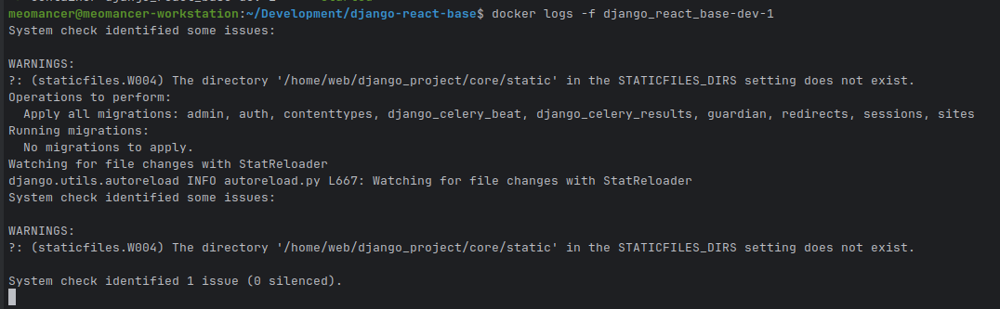

# Run without IDE

If you're using a text editor other than an IDE (such as PyCharm, Sublime Text, or Vim), you can run the application manually from the terminal:

1. Navigate to the root directory of the project.
2. Open a terminal and execute the following command:

```
make dev
```

Note: With this approach, you won’t have access to integrated debugging features provided by full IDEs.

To verify that the development instance is running correctly, execute the following command:
```bash
docker logs -f django_react_base-dev-1
```
Allow the process to continue until the following message or indicator appears:



Once this confirmation is visible, you may proceed to the next step to access your running instance.

## Viewing your test instance

After completing the steps above, you should have the development server available on port 2000 of your local host:

```
http://localhost:8000
```


By Default, we can use the admin credential:
```
username : admin
password : admin
```

> 🪧 Now that the application is set up, you may begin making updates.