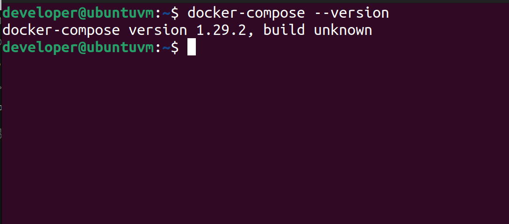

## 🐧 Ubuntu 24.04 LTR Setup Guide

### VSCode

For Ubuntu Linux, it is recommended to install it via:

```bash
sudo snap install code --classic
```

You should now have [VSCode](https://code.visualstudio.com/) installed.

You also need to have the code CLI available.

To check:

```bash
code --version
```

It should return something like the output below:

```bash
1.100.2
848b80aeb52026648a8ff9f7c45a9b0a80641e2e
x64
```

## Setup Docker on Linux

In this section we cover any tools that need to be on your system so that you
can have a local development environment.

## Docker

We assume in our notes that you are using the current Ubuntu LTS - though we
try to keep things generic so that you can repeat on other distros or WSL2 on
windows.

We recommend using the official Docker packages (not those provided by your
distro) and assume membership of the docker group.
See [docker.io's guide](https://docs.docker.com/engine/install/ubuntu/) for
setup notes and below for adding yourself to the docker group.

```bash
sudo usermod -a -G docker $user
```

(Restart your computer after making this change)

You need to have docker-compose installed - version 1.29 or later should work
fine.



## Dependencies installation

The project provide **make** command that making setup process easier.
To install make on your machine or virtual box server, do:

```bash
sudo apt install make
```

Project has recipe that you can use to run the project in one command.
This recipe needs docker-compose to be able to use it.
To install it, do:

```bash
sudo apt install docker-compose
apt install ca-certificates curl gnup lsb-release  
```

## Docker installation

The project needs docker to be able to run it. To install docker, please follow
these instructions.

```bash
curl -fsSL https://download.docker.com/linux/ubuntu/gpg | sudo gpg --dearmor -o /usr/share/keyrings/docker-archive-keyring.gpg     
```

On the next prompt line:

```bash
echo \
"deb [arch=$(dpkg --print-architecture) signed-by=/usr/share/keyrings/docker-archive-keyring.gpg]https:download.docker.com/linux/ubuntu \
$(lsb_release -cs) stable" | sudo tee /etc/apt/sources.list.d/docker.list > /dev/null
```

Run apt update:

```bash
sudo apt-get update
```

This will install docker

```bash
sudo apt-get install  docker-ce-cli containerd.io
```

This will check if installation of docker was successful

```bash
sudo docker version
```

And it should return like this

```bash
Client: Docker Engine - Community
 Version:           20.10.9
 API version:       1.41
 Go version:        go1.16.8
 Git commit:        c2ea9bc
 Built:             Mon Oct  4 16:08:29 2021
 OS/Arch:           linux/amd64
 Context:           default
 Experimental:      true

```

### Manage docker as non-root

This will ensure that the docker can be executed without sudo.

```bash
sudo systemctl daemon-reload
sudo systemctl start docker
sudo usermod -a -G $USER
sudo systemctl enable docker
```

Verify that you can run docker commands without sudo.

```bash
docker run hello-world
```

For more information how to install docker, please
visit [Install Docker Engine](https://docs.docker.com/engine/install/)

## Git

Make sure you have [Git](https://git-scm.com/) installed.

## Next Steps

> 🪧 Now that you have the docker, move on to the generic workflow, starting
> with [Cloning](../setup-generic/cloning.md).