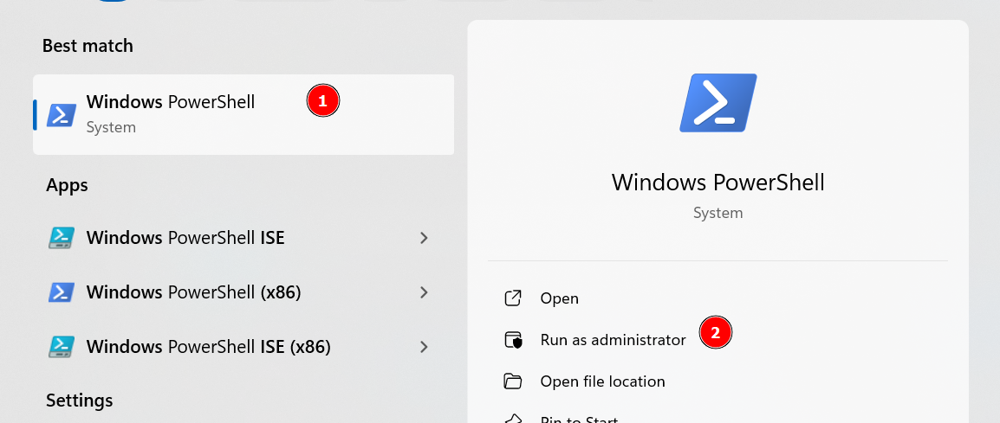
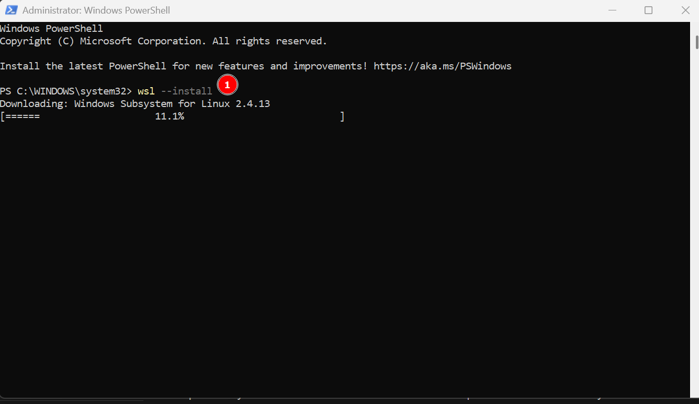
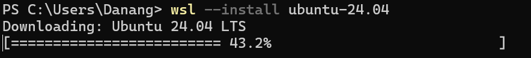
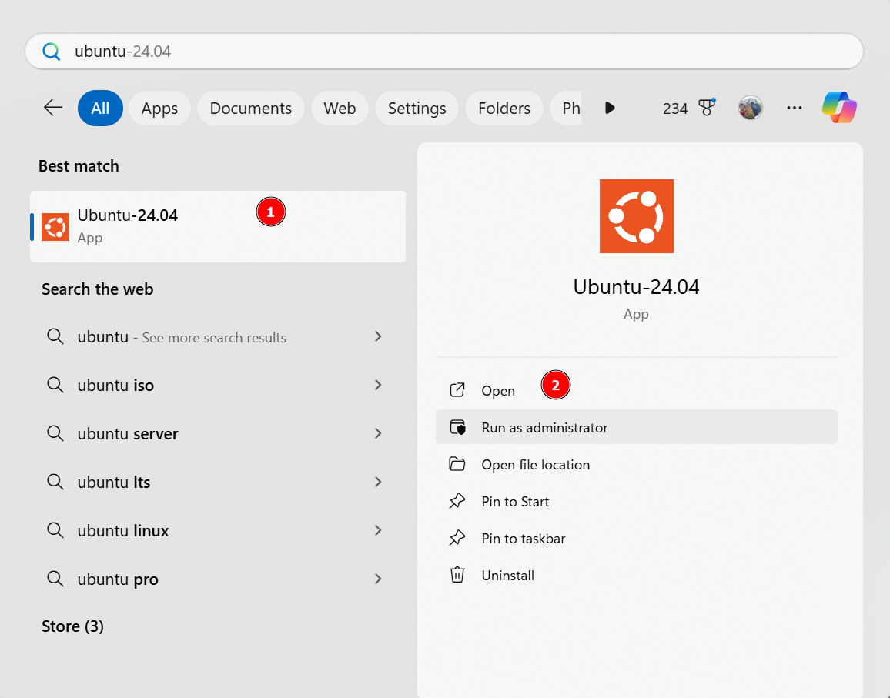
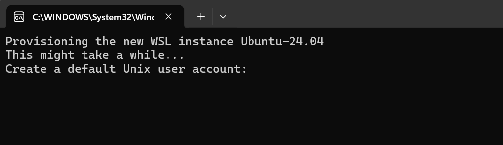
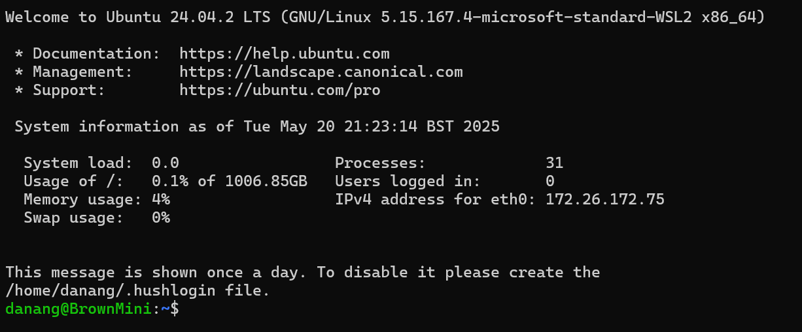
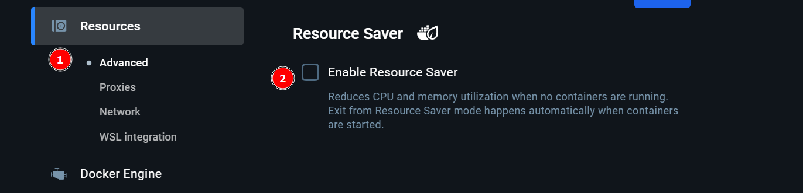

For windows development setup, we will use WSL2 (Windows Subsystem for Linux)
to run the development environment. This allows us to run a Linux distribution
on Windows, which is more compatible with the tools and libraries used in
django application.

## WSL2

WSL2 is needed to run linux environment in Windows. Follow step by step below
to install WSL2.

Open Powershell as Administrator



Install wsl2 with below command

```bash
wsl --install
```



Once completed, you need to restart the machine. You can check if the
installation is completed successfully by checking the list of installed
distribution from the Powershell.

```bash
wsl --list
```

By default, the Ubuntu is chosen and installed after running the first command.
However if there is no distribution that is installed like image below, we can
then install it manually.


To list all the available distribution, we can run command:

```bash
wsl --list --online
```

The results:

```bash
The following is a list of valid distributions that can be installed.
Install using 'wsl.exe --install <Distro>'.

NAME                            FRIENDLY NAME
AlmaLinux-8                     AlmaLinux OS 8
AlmaLinux-9                     AlmaLinux OS 9
AlmaLinux-Kitten-10             AlmaLinux OS Kitten 10
Debian                          Debian GNU/Linux
FedoraLinux-42                  Fedora Linux 42
SUSE-Linux-Enterprise-15-SP5    SUSE Linux Enterprise 15 SP5
SUSE-Linux-Enterprise-15-SP6    SUSE Linux Enterprise 15 SP6
Ubuntu                          Ubuntu
Ubuntu-24.04                    Ubuntu 24.04 LTS
archlinux                       Arch Linux
kali-linux                      Kali Linux Rolling
openSUSE-Tumbleweed             openSUSE Tumbleweed
openSUSE-Leap-15.6              openSUSE Leap 15.6
Ubuntu-18.04                    Ubuntu 18.04 LTS
Ubuntu-20.04                    Ubuntu 20.04 LTS
Ubuntu-22.04                    Ubuntu 22.04 LTS
OracleLinux_7_9                 Oracle Linux 7.9
OracleLinux_8_7                 Oracle Linux 8.7
OracleLinux_9_1                 Oracle Linux 9.1
```

We will use the latest Ubuntu version, 24.04 LTS. To install it, run command:

```bash
wsl --install Ubuntu-24.04
```



Once ubuntu is installed, we can setup the user account for Ubuntu. Search for
ubuntu from the search bar and click Open to run it.



It will open a terminal where you can setup username and password for your
Ubuntu.



After your user account is created, you will see below image that indicates the
installation is successful.



You should update your system after this by running command:

```bash
sudo apt-get update && sudo apt-get upgrade
```

## Install Git

```bash
sudo apt-get install git
```

## (Optional) SSH Setup

The SSH are preferred when fetching and pushing codes to GitHub. Please
follow [this link](https://docs.github.com/en/authentication/connecting-to-github-with-ssh/generating-a-new-ssh-key-and-adding-it-to-the-ssh-agent?platform=linux#generating-a-new-ssh-key)
to generate SSH key pair and add it into your GitHub account.

## (Optional) GPG Setup

GPG signing keys are used to sign the commits. WSL2 can use the keys from
Windows by
following [this tutorial](https://gist.github.com/matthiasr/473072eeffe449459e3ccd0f5192afc7).
Next, we need to update the configuration inside WSL2, edit or create if this
file does not exist: `~/.gnupg/gpg-agent.conf`.

```bash
default-cache-ttl 34560000
max-cache-ttl 34560000
pinentry-program "/mnt/c/Program Files (x86)/GnuPG/bin/pinentry-basic.exe"
```

It is recommended to explicitly restart the gpg agent to force these changes.
Alternatively, restart Windows at this point.

```bash
gpgconf --kill gpg-agent
```

Once the key is generated, please
follow [this link](https://docs.github.com/en/authentication/managing-commit-signature-verification/adding-a-gpg-key-to-your-github-account)
to add it into your GitHub account.

## Docker Setup

Follow [this guide](https://learn.microsoft.com/en-us/windows/wsl/tutorials/wsl-containers#overview-of-docker-containers)
to install docker desktop that integrates with WSL2. After docker is installed
and running, we recommend to disable the `Resource Saver` feature as it may
cause unexpected issue during development.



## Install VSCode

Follow the installation steps
from [this link](https://code.visualstudio.com/docs/setup/windows) to setup the
VSCode on Windows. The VSCode CLI will also be installed in the WSL2 and you
can check by running below command in the WSL2 Ubuntu terminal.

```bash
code --version
```

It will return output like below:

```bash
1.100.2
848b80aeb52026648a8ff9f7c45a9b0a80641e2e
x64
```

## Next Steps

> 🪧 Now that you have the docker, move on to the generic workflow, starting
> with [Cloning](../setup-generic/cloning.md).
