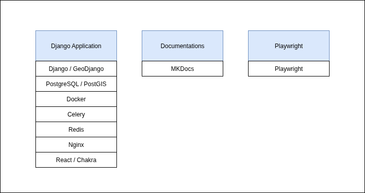
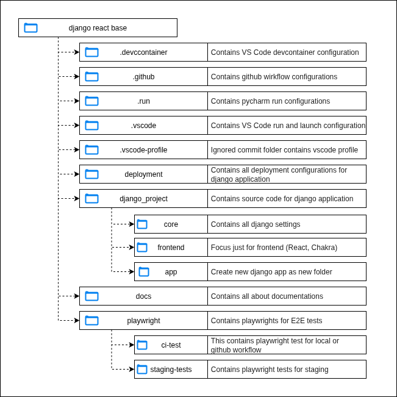

# For Developers

The Django React Base Project is a Django project structured into several components.
It includes a Django application, Playwright for end-to-end testing, and project documentation.

Each component serves a different purpose.

### Key Components

- **[Django application](django/architecture-overview.md)**: Contains the main Django codebase, organized into the **deployment** and **django_project** folders.
- **Playwright**: Located in the **playwright** folder. Contains all end-to-end tests for the application and is integrated into the GitHub workflow.
- **Documentation**: Located in the **docs** folder. Contains all project documentation, which is being built in the GitHub workflow.

### Repo Components

### Repo Diagram

